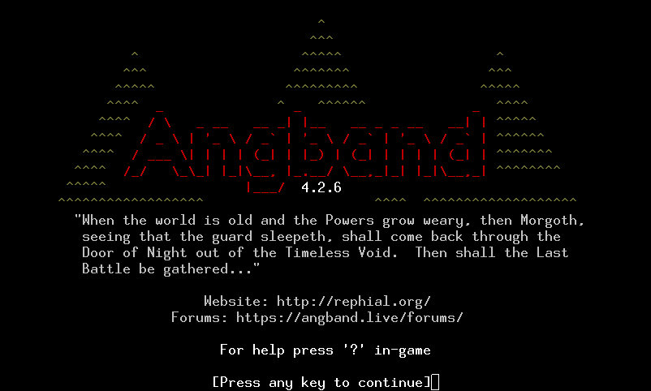
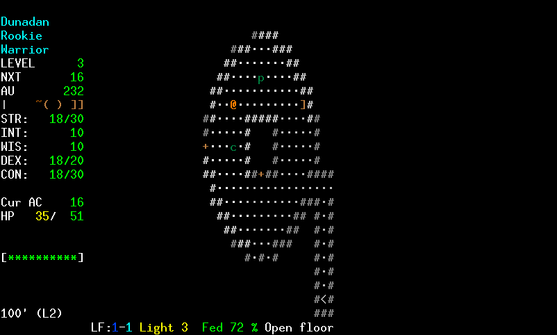

# SWangband

SWangband is a modified version of Angband 4.2.6 with four gameplay additions:
Living Stores, Second Wind, Difficulty Presets, and Danger Telemetry.

---

## What's Different

### Living Stores
Shop inventories scale with your current dungeon depth. The deeper you've
ventured, the better the stock you'll find when you return to town. Items
rotate periodically — if you pass on something, it may be gone next visit.
This makes town trips more meaningful and rewards deeper exploration.

### Second Wind
Instead of dying you receive a second chance: your HP is restored to a
fraction of maximum and you continue from where you fell. The sidebar shows
your remaining charges ("Wind: 1" when available, blank when spent). Enable
or disable this at character creation with the **Second Wind** birth option.

**Recharging at the Bookseller.** Once your charge is spent you can restore
it by visiting the Bookseller in town. The service costs a gold donation
(scales with your character level) plus a 15–20% tithe of your current
experience — the exact percentage varies each visit. After recharging you
must descend at least one dungeon level deeper than your current maximum
before the service is available again, preventing repeated town trips from
trivializing death. The entry at the bottom of the Bookseller's list shows
the current status: dim when your charge is still active, blue when you can
recharge, and orange when the depth requirement has not yet been met.

### Difficulty Presets
The first thing you see when starting a new game is a preset picker. Choose
one of three presets to configure Second Wind, Danger Telemetry, and economy
settings in one step. You can still tweak individual options afterwards.

| Preset | Second Wind | Threat meter | Economy | Death |
|--------|-------------|--------------|---------|-------|
| **Wanderer** | 3 charges | On | No selling (generous gold drops) | Second chances |
| **Adventurer** *(recommended)* | 1 charge | On | Standard | Second chance |
| **Legend** | None | Off | Standard | Permadeath |

**Wanderer** is aimed at first-timers: three second chances, a visible danger
readout, and a no-selling economy where gold comes from drops rather than
shops, so you always have enough to buy what you need.

**Adventurer** is the intended experience: one second chance and the threat
meter on, standard gold economy.

**Legend** is vanilla permadeath — no safety net, no threat warnings, one life.

### Danger Telemetry
A threat meter appears in the sidebar showing the danger level of monsters
currently visible on the map. The meter updates as monsters move in and out
of view and updates when your HP changes. Levels are:

| Label   | Meaning                                      |
|---------|----------------------------------------------|
| SAFE    | No dangerous monsters in sight               |
| CAUTION | Monsters present but manageable              |
| DANGER  | Significant threat — consider retreating     |
| LETHAL  | Extreme danger — immediate action required   |

Enable or disable the threat meter with the **Show threat meter** option
(`=` → Birth options → Show threat meter).

---

# Angband 4.2.6

  
  

Angband is a graphical dungeon adventure game that uses textual characters to
represent the walls and floors of a dungeon and the inhabitants therein, in the
vein of games like NetHack and Rogue. If you need help in-game, press `?`.

- **Installing Angband:** See the [Official Website](https://angband.github.io/angband/) or [compile it yourself](https://angband.readthedocs.io/en/latest/hacking/compiling.html).
- **How to Play:** [The Angband Manual](https://angband.readthedocs.io/en/latest/)
- **Getting Help:** [Angband Forums](https://angband.live/forums/)

Enjoy!

-- The Angband Dev Team
